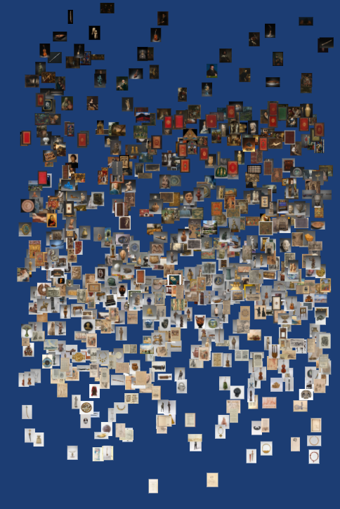
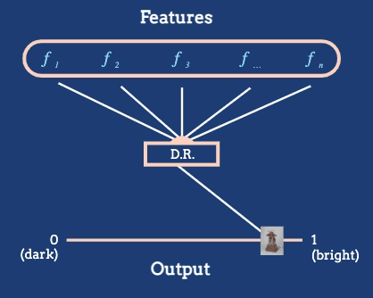

```{r setup, include=FALSE}
library("knitr")
opts_chunk$set(cache = FALSE, message = FALSE, warning = FALSE, echo = FALSE)
```

_[Reading](),[Recording](),[Rmarkdown]()_

1. *High-dimensional* data are data where many features are collected for each
observation. If we organize our data.frame so that each observation is a
separate row, then these data have many columns. The name comes from the fact
that each row of the dataset can be viewed as a vector in a high-dimensional
space (one dimension for each feature). These data are common in modern
applications,

* Each cell in a genomics dataset might have measurements for hundreds of molecules.
* Each survey respondent might provide answers to dozens of questions.
* Each image might have several thousand pixels.
* Each document might have counts across several thousand relevant words.

2. For low-dimensional data, we could encode all the features in our data
directly, either using properties of marks or through clever faceting. In
high-dimensional data, this is no longer possible.

3. Even though there are many features associated with each observation, it may
still be possible to organize samples across a smaller number of meaningful,
derived features.

4. For example, consider the Metropolitan Museum of Art dataset, which contains
images of many artworks. Abstractly, each artwork is a high-dimensional object,
containing pixel intensities for many pixels. But it is reasonable to derive
features based on the average brightness.

```{r, fig.cap = "An arrangement of artworks according to their average pixel brightness, as given in the reading.", fig.align = "center"}

```

5. Informally, the goal of dimensionality reduction techniques is to produce a
low-dimensional "atlas" relating members of a collection of complex objects.
Samples that are similar to one another in the high-dimensional space should be
placed near one another in the low-dimensional view.

6. Continuing with the example, we might want to construct a lower-dimensional
map that places similar artworks next to one another. However, manual feature
construction can be difficult. Algorithmic approaches try streamline the process
of generating these maps by optimizing some more generic criterion. Different
algorithms use different criteria, which we will review in the next couple of
lectures.

```{r, fig.cap = "The dimensionality reduction algorithm in this animation converts a large number of raw features into a position on a one-dimensional axis defined by average pixel brightness. In general, we might reduce to dimensions other than 1D, and we will often want to define features tailored to the dataset at hand.", out.width = 400, fig.align = "center"}

```
