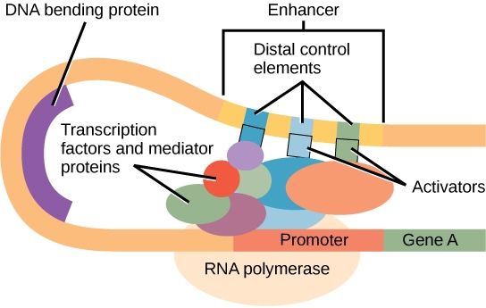

## Problem Formulation

1. Enhancers are DNA sequences that coordinate downstream gene expression.
Their activity depends on genome state, like transcription factor binding and
chromatin state.

   {width=60%}

1. Understanding enhancers means understanding how genotype becomes phenotype, a
fundamental problem in biology.  To make the problem tractable, we usually study
it in simple organisms, like the fruit fly _Drosophila melanogaster_, often during embryo development.

   {width=60%}

1. [@Basu2018] asked a precise question: given the genomic state of a fruit fly
embryo at a fixed developmental stage, can we predict whether a given enhancer
is active? They used genome-wide measurements from blastoderm (stage 5) embryos:

    - DNA occupancy for 23 transcription factors
    - Activity for 13 chromatin markers
    - Binary enhancer activity labels

1. This is a binary classification problem.
   Each observation is a genomic region with associated regulatory features.

   - Enhancer status: $y \in \{0,1\}$
   - Predictors: $x = (x_1, \ldots, x_D)$ transcription factor binding intensities and chromatin signals
   - Model: $f(x_i) = \mathbb{P}(y_i = 1 \mid x_i)$

   SHAP quantifies each feature's contribution to $f(x_i)$.

## Setup

The first three packages below train the boosting model. The rest are for
visualization and SHAP explanation.

```{r}
#| label: setup
source("https://github.com/krisrs1128/stat479_notes/raw/refs/heads/master/activities/05-helpers.R")
library(mlr3)
library(mlr3learners)
library(mlr3tuning)
library(patchwork)
library(shapviz)
library(tidyverse)
theme_set(theme_classic())
set.seed(20251227)
options(mlr3.store_backends = TRUE)
```

This block downloads the data. Enhancer is stored in the first column `y`.

```{r}
#| label: load-data
f <- tempfile()
download.file("https://zenodo.org/records/18371236/files/enhancer.Rdata?download=1", f)
load(f)

enhancer <- bind_cols(y = as.factor(Y), X)
enhancer
```

## Model Training

We train a boosting classifier on the enhancer data. The tuning grid considers
the number of trees `nrounds` and learning ratae `eta`, selecting
hyperparameters using three fold CV.

```{r}
#| label: tune-setup
task <- as_task_classif(enhancer, target = "y", id = "enhancer", positive = "1")
learner <- lrn("classif.xgboost", nrounds = to_tune(100, 200), eta = to_tune(1e-3, 0.1), predict_type = "prob")

instance <- ti(
    task = task,
    learner = learner,
    resampling = rsmp("cv", folds = 3),
    measures = msr("classif.auc"),
    terminator = trm("none")
)
```

We run the hyperparameter tuning next.

```{r}
#| label: tune
tuner <- tnr("grid_search", resolution = 5, batch_size = 5)
tuner$optimize(instance)
```

Let's refit the model with the optimized hyperparameters.

```{r}
#| label: fit
learner$param_set$values <- instance$result_learner_param_vals
task <- as_task_classif(enhancer, target = "y", id = "enhancer", positive = "1")
learner$train(task)
```

The histogram of predicted probabilities shows that the model behaves as
expected: inactive enhancers (class 0) clusters near zero probability, and
active enhancers (class 1) is more spread to high probability regions. Though,
there is still noticeable overlap.

```{r}
#| label: predictions
#| fig-height: 4
#| fig-width: 6
tibble(p_hat = learner$predict_newdata(enhancer)$prob[, 1], y = enhancer$y) |>
    ggplot() +
    geom_histogram(aes(p_hat, fill = y)) +
    facet_grid(y ~ ., scales = "free_y")
```

## Interpretation Setup

Entry $(i, d)$ of `shp$S` is the SHAP attribution $\varphi_d(x_i)$, feature
$d$'s contribution to $f(x_i)$.

```{r}
#| label: shap-setup
#| fig-height: 4
#| fig-width: 4
X_mat <- as.matrix(X)
shp <- shapviz(learner$model, X_pred = X_mat)
shp$S[1:5, 1:8]
```

The efficiency axiom holds, though on a log-odds scale: $\sum_d \varphi_d(x_i) +
\varphi_0 = \text{logit}^{-1}\mathbb{P}(y \vert x_i)$. Most feature importances
measures lack this sum-to-prediction property; this is something that helps SHAP
stand out.

```{r}
#| label: shap-efficiency
#| fig-height: 2.5
#| fig-width: 2.5
y_hat <- predict(learner$model, X_mat, outputmargin = TRUE)

tibble(y_hat = y_hat, sum_phi = rowSums(shp$S) + shp$baseline) |>
    ggplot() +
    geom_point(aes(y_hat, sum_phi)) +
    labs(
        x = "Model Prediction (Log-Odds)",
        y = "Sum of SHAP Attributions"
    )
```

### Variable-Level Pltos

The beeswarm plot ranks features using $\left|\varphi_d(x_i)\right|$. Across
many samples, the `wt_ZLD`, `input_c14c`, and `sna1` features stand out. For most
features, the attributions have consistent signs across samples, but the tails
show that the sign can flip, perhaps when the feature has an unusual
value/context.

```{r}
#| label: importance
#| fig-height: 5
#| fig-width: 5
sv_importance(shp, kind = "bee")
```

The dependence plot for `sna1` shows that high `sna1` TF binding leads to
positive attribution.

```{r}
#| label: dependence
#| fig-height: 4
#| fig-width: 6
sv_dependence(shp, "sna1")
```

This is consistent with the data, where large `sna1` increases enhancer
activity. The [`sna1`](https://en.wikipedia.org/wiki/SNAI1) gene is generally a
transcriptional repressor, but in these data, it seems that when `sna1` is
present at a location, the enhancer is more likely to be active.

```{r}
```{r}
#| label: sna1-detail
#| fig-height: 4
#| fig-width: 6
tibble(p_hat = predict(learner$model, X_mat, outputmargin = TRUE), y = enhancer$y, x= enhancer$sna1) |>
    ggplot() +
    geom_point(aes(x, p_hat, col = y)) +
    labs(x = "Value of SNA1 Feature", y = "Log-Odds", col = "True Class")
```

### Sample-Level Plots

Alternatively, waterfall plots break a single prediction down into feature
contributions. Each bar is one feature, and tracking the endpoints across bars
shows how the model arrives at the output by weighing evidence across many
features.

```{r}
#| label: waterfall
#| fig-height: 5
#| fig-width: 6
map(seq_len(6), \(i) sv_waterfall(shp, max_display = 8, row = i)) |>
    reduce(`+`)
```

Waterfall plots don't scale well to many samples. A stacked bar alternative
solves this issue -- each vertical bar below is one sample, colored by SHAP
attributions for the 11 most improtant features. Samples are sorted so that
those with similar attribution profiles are side-by-side. The "x" marks  give
the actual log-odds predictions, and features above or below indicate positive
or negative attributions, respectively.

The block below calls our
helper functions (in
[05-helpers.R](https://github.com/krisrs1128/stat479_notes/blob/master/activities/05-helpers.R))
to perform this ordering.

```{r}
#| label: shap-bars
var_order <- order(abs(colSums(shp$S)), decreasing = TRUE)
important_vars <- colnames(shp$S)[var_order] |>
    head(11)

ix <- sample(1:nrow(enhancer), 500)
shap_bars <- shap_to_long(shp$S[ix, ], y_hat[ix], shp$baseline, important_vars) |>
    add_waterfall_offsets()
```

This view shows that samples with nearly identical predictions can have
different reasons for those predictions. For example, `kr1` drives high
predictions for a cluster of sequences near the left, but has barely any
influence elsewhere.

```{r}
#| label: waterfall-custom
#| fig-height: 4
#| fig-width: 8
ggplot(shap_bars) +
    geom_hline(yintercept = 0) +
    geom_rect(aes(xmin = xpos - 0.45, xmax = xpos + 0.45, ymin = ymin, ymax = ymax, fill = name, col = name)) +
    geom_point(
        data = distinct(shap_bars, xpos, pred),
        aes(xpos, pred),
        size = 3,
        shape = "x"
    ) +
    labs(y = "Prediction relative to E[f(x)]", x = "Samples", fill = "Feature", col = "Feature") +
    scale_x_continuous(expand = c(0, 0)) +
    scale_fill_brewer(palette = "Set3", na.value = "#dcdcdc") +
    scale_color_brewer(palette = "Set3", na.value = "#dcdcdc") +
    theme(
        axis.ticks = element_blank(),
        axis.text.x = element_blank(),
    )
```
