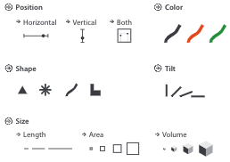
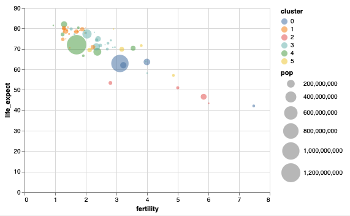
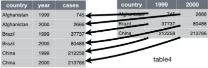

```{r setup, include=FALSE}
knitr::opts_chunk$set(echo = FALSE)
```

In this course, we'll see how ideas from statistics and visualization can
enhance our power of critical observation. We'll develop a foundation for
designing and implementing effective visualizations, and we'll see how they can
be integrated into the data science workflow, the day-to-day work of science.

It's something of a paradox, but statistics has two contradictory roles in science,

* Data summarization: Our brains are bad at processing large collections of
  numbers, but good at making visual comparisons. Statistics can compress a
  complicated dataset into a succinct representation, something that might be
  possible to visualize and hopefully wrap our heads around.
* Data generation: In a way, the results of a statistical analysis are
  themselves new data. A standard error gives information about the stability of
  an estimate; the results of a randomized experiment give new information about
  hypothetical manipulations.

We'll see these two themes throughout the semester, finding ways to navigate
complex datasets and coaxing relevant data out of black boxes, for example.

## Syllabus

The official syllabus, which gives requirements, learning objectives, and
grading mechanisms, is available
[here](https://docs.google.com/document/d/1GCx9EJJpYg1pDp7kSK-deYO7VyTjnhvcZh-RWS0uvIw/edit).

## Homework

Assignments will be due every other Friday. Submissions must be made on [Canvas](tbd).

* Homework 1 (Due: )

## Project

Your group projects will allow you to apply statistical data visualization
techniques to a dataset or model of interest.

* Group formation (Due: )
* Milestone 1 (Due: )
* Milestone 2 (Due: )
* Milestone 3 (Due: )
* Milestone 4 (Due: )

## Readings

| Week | Reading | Notes | Lectures |
| - | --- | - | - |
| 1 <br/>  | [VAD](https://search.library.wisc.edu/catalog/9911196629502121): Chapter 5 <br/> [IDS](https://rafalab.github.io/dsbook): Chapter 7 | | |
| 1 (optional) | [Data Humanism](http://giorgialupi.com/data-humanism-my-manifesto-for-a-new-data-wold) <br/> \ [As We May Think](https://www.theatlantic.com/magazine/archive/1945/07/as-we-may-think/303881/) | | |
| 2 <br/>  | [VAD](https://search.library.wisc.edu/catalog/9911196629502121): Chapter 12 <br/> [IDS](https://rafalab.github.io/dsbook): Chapter 9 <br/> [Data Types, Graphical Marks, and Visual Encoding Channels](https://observablehq.com/@uwdata/data-types-graphical-marks-and-visual-encoding-channels?collection=@uwdata/visualization-curriculum) | | |
| 3 <br/>  | [RDS](https://r4ds.had.co.nz): Chapter 12 <br/> [Multi-View Composition](https://observablehq.com/@uwdata/multi-view-composition?collection=@uwdata/visualization-curriculum) | | |
| 4 | [VAD](https://search.library.wisc.edu/catalog/9911196629502121): Chapter 7 <br/> [Scales, Axes, and Legends](https://observablehq.com/@uwdata/scales-axes-and-legends?collection=@uwdata/visualization-curriculum) | | |
| 5 | [Visualizing statistical models: Removing the blindfold](https://vita.had.co.nz/papers/model-vis.html) <br/> [Four Experiments in Handwriting with a Neural Network](https://distill.pub/2016/handwriting/) | | |
| 6 | [Logistic Regression Diagnostics](https://projecteuclid.org/euclid.aos/1176345513) <br/> [What Neural Networks Memorize and Why: Discovering the Long Tail via Influence Estimation](https://arxiv.org/abs/2008.03703) | | |
| 7 | [VAD](https://search.library.wisc.edu/catalog/9911196629502121): Chapter 11 <br/> [Interaction](https://observablehq.com/@uwdata/interaction?collection=@uwdata/visualization-curriculum) | | |
| 8 | [VAD](https://search.library.wisc.edu/catalog/9911196629502121): Chapter 14 <br/> [Up and Down the Ladder of Abstraction](http://worrydream.com/LadderOfAbstraction/) | | |
| 9 | [VAD](https://search.library.wisc.edu/catalog/9911196629502121): Chapter 8 <br/> [Geo](https://geocompr.robinlovelace.net/spatial-class.html): Chapter 2 | | |
| 10 | [VAD](https://search.library.wisc.edu/catalog/9911196629502121): Chatper 9 <br/> [MSMB](http://web.stanford.edu/class/bios221/book/Chap-Graphs.html): Chapter 10.1 - 10.3 | | |
| 11| [Beginner's Guide to Dimensionality Reduction](https://idyll.pub/post/visxai-dimensionality-reduction-1dbad0a67a092b007c526a45/) <br/> [Topic Models](https://www.tidytextmining.com/topicmodeling.html) <br/> [How to use t-SNE effectively](https://distill.pub/2016/misread-tsne/) | | |
| 12 | [Visualizing and Understanding Convolutional Networks](https://arxiv.org/abs/1311.2901) <br/> [SVCCA: Singular Vector Canonical Correlation Analysis for Deep Learning Dynamics and Interpretability](https://arxiv.org/abs/1706.05806) | | |
| 13 | [Seq2Seq-Vis: A Visual Debugging Tool for Sequence-to-Sequence Models](https://arxiv.org/abs/1804.09299) <br/> [Human-Machine Collaboration for Fast Land Cover Mapping](https://arxiv.org/pdf/1906.04176.pdf) | | |
| 13 (optional) | [Automation Makes Us Dumb](https://www.wsj.com/articles/automation-makes-us-dumb-1416589342) | | |
| 14 | [DataSketches: Community](http://www.datasketch.es/april/) <br/> [Tukey, Design Thinking, and Better Questions](https://simplystatistics.org/2019/04/17/tukey-design-thinking-and-better-questions/) <br/> [Musicians and mortality](https://www.callingbullshit.org/case_studies/case_study_musician_mortality.html)  | | |