```{r setup, include=FALSE}
knitr::opts_chunk$set(echo = FALSE)
```

The official syllabus, which gives requirements, learning objectives, and
grading mechanisms, is available
[here](https://canvas.wisc.edu/courses/243146/files/17520097?module_item_id=3538748).
This website only includes links to the reading and lecture content -- the
course structure is mapped out fully on the [Canvas
homepage](https://canvas.wisc.edu/courses/243146).

## Readings

| Week | Topic | Reading |
| - | - | --- |
| 1 <br/>  | Marks and Channels | (1) [Introduction to Data Science: Chapter 7](https://rafalab.github.io/dsbook/ggplot2.html) <br/> (2) [Data Types, Graphical Marks, and Visual Encoding Channels](https://observablehq.com/@uwdata/data-types-graphical-marks-and-visual-encoding-channels?collection=@uwdata/visualization-curriculum) |
| 1 (optional) | | (1) [Data Humanism](http://giorgialupi.com/data-humanism-my-manifesto-for-a-new-data-wold) |
| 2 <br/> 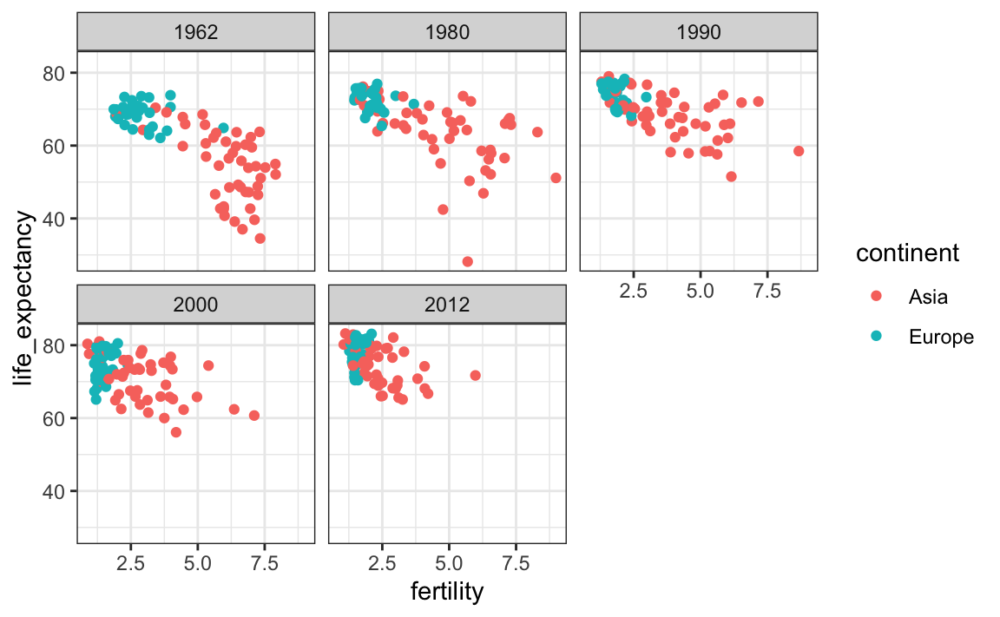 | Faceting and Layout | (1) [Introduction to Data Science: Chapter 9.1 - 9.3](https://rafalab.github.io/dsbook/gapminder.html)<br/> (2) [Multi-View Composition](https://observablehq.com/@uwdata/multi-view-composition?collection=@uwdata/visualization-curriculum) |
| 3 <br/> 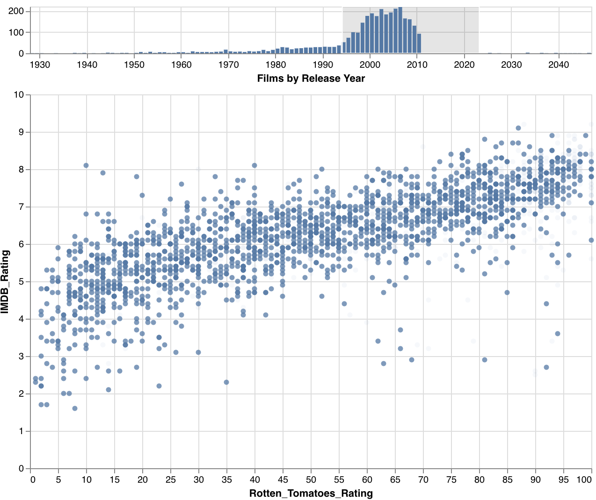 | Interaction | (1) [Visualization Analysis and Design: Chapter 11](https://search.library.wisc.edu/catalog/9911196629502121)<br/> (2) [Interaction](https://observablehq.com/@uwdata/interaction?collection=@uwdata/visualization-curriculum) |
| 3 (optional) | | [Up and Down the Ladder of Abstraction](http://worrydream.com/LadderOfAbstraction/) |
| 4 <br/>  | Data Wrangling | [R for Data Science: Chapter 12](https://r4ds.had.co.nz) |
| 5 <br/> 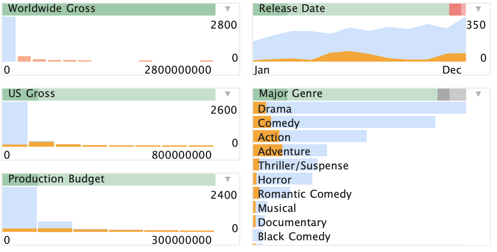 | Quality Checking | (1) [Getting Started with naniar](https://naniar.njtierney.com/articles/getting-started-w-naniar.html) <br/> (2) [Profiler: Integrated Statistical Analysis and Visualization for Data Quality Assessment](https://idl.cs.washington.edu/files/2012-Profiler-AVI.pdf) |
| 6 <br/> 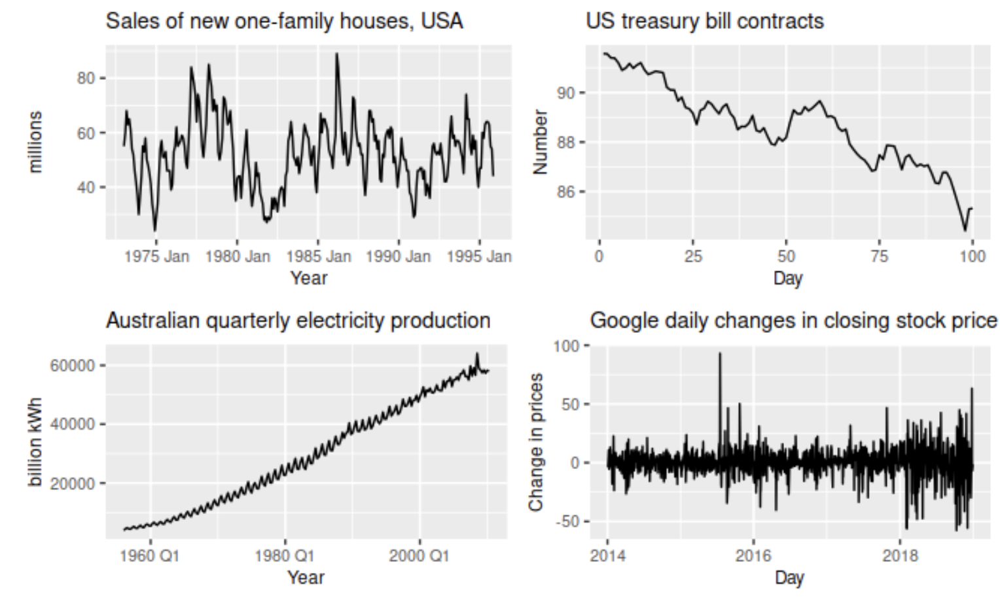 | Time Series | [Forecasting Principles and Practice: Chapter 2](https://otexts.com/fpp3/graphics.html) |
| 7 <br/> 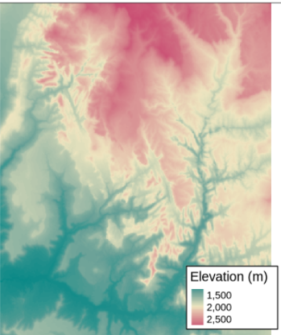 | Geographic Data | [Geographic Data in R: Chapter 2](https://geocompr.robinlovelace.net/spatial-class.html) |
| 8 <br/> 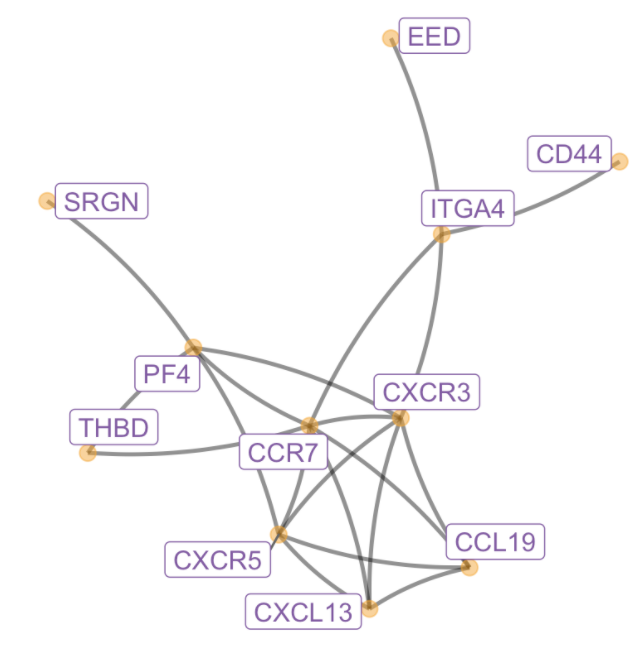| Network Data | (1) [Visualization Analysis and Design: Chapter 9](https://search.library.wisc.edu/catalog/9911196629502121) <br/> (2) [Modern Statistics for Modern Biology: Chapter 10.1 - 10.3](http://web.stanford.edu/class/bios221/book/Chap-Graphs.html)|
| 9 <br/> 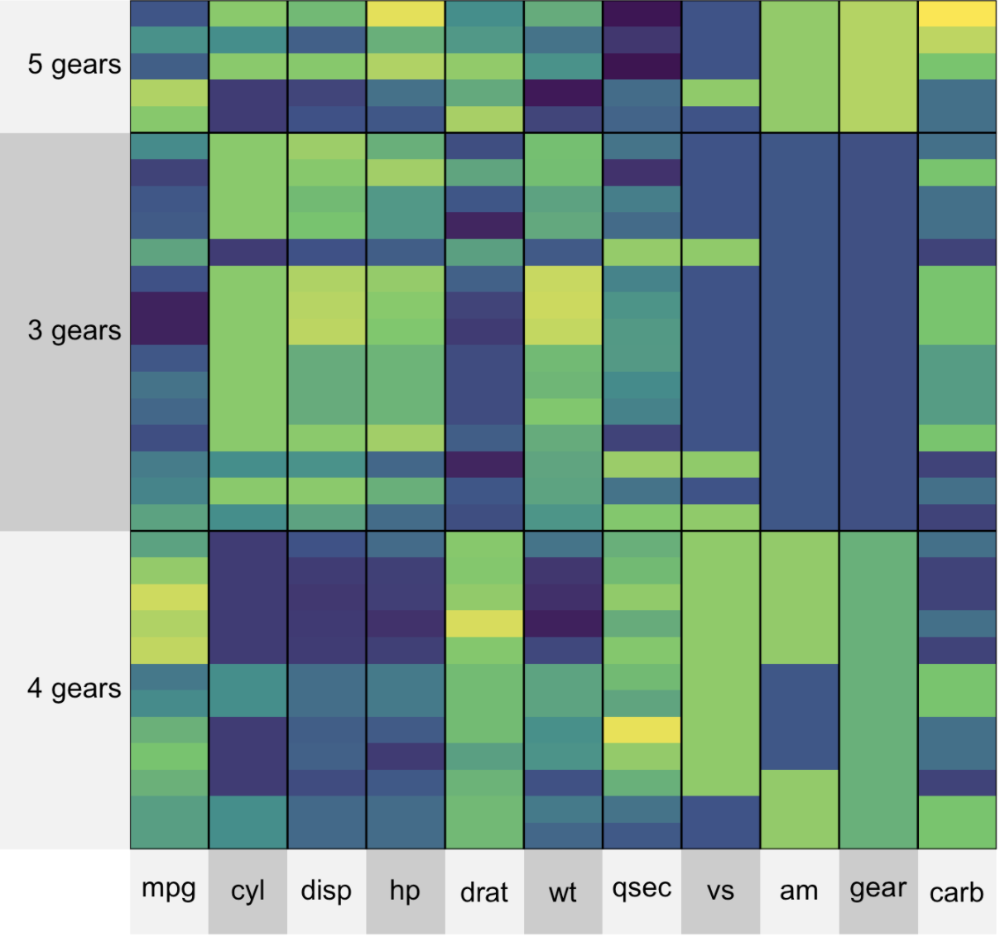 | Clustering | (1) [Intro to Data Science: Chapter 34](https://rafalab.github.io/dsbook/clustering.html)<br/> (2) [Superheat Vignette (2, 3 & 6)](https://rlbarter.github.io/superheat/basic-usage.html) <br/> (3) [Cluster Analysis of Genomic Data](http://users.umiacs.umd.edu/~hcorrada/CMSC702/readings/Solutions_ch13.pdf) |
| 10 <br/> 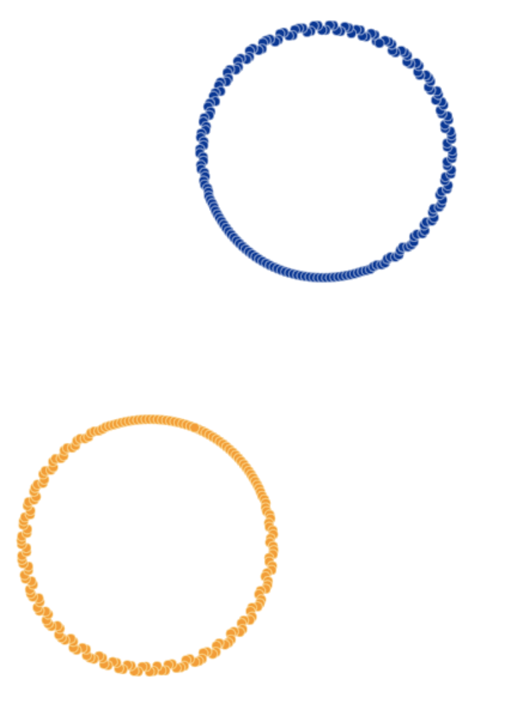| Dimensionality Reduction I | (1) [Beginner's Guide to Dimensionality Reduction](https://idyll.pub/post/visxai-dimensionality-reduction-1dbad0a67a092b007c526a45/)  <br/> (2) [An Illustrated Introduction to the t-SNE algorithm](https://github.com/oreillymedia/t-SNE-tutorial) <br/> (3) [How to use t-SNE effectively](https://distill.pub/2016/misread-tsne/) |
| 11 <br/> 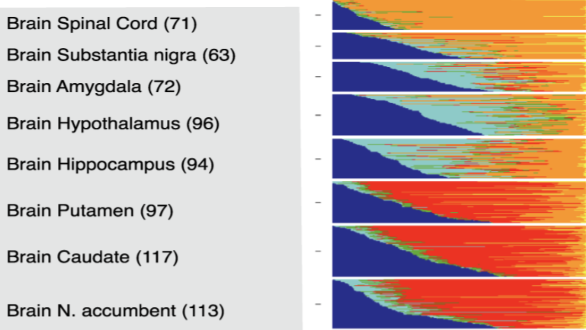| Dimensionality Reduction II | (1) [Text mining with R: Chapter 6](https://www.tidytextmining.com/topicmodeling.html) <br/> (2) [Termite: Visualization Techniques for Assessing Textual Topic Models](https://d1wqtxts1xzle7.cloudfront.net/30738409/2012-Termite-AVI.pdf?1362144247=&response-content-disposition=inline%3B+filename%3DTermite_Visualization_Techniques_for_Ass.pdf&Expires=1608157711&Signature=OiLaMpnhwGe~4yVIW4bQScUEjvFm-mH7wBqWjNKA47g4jdzWtyMdEE2X-WkuEUwVLb7IGQzy0MfV~oI8Y47XT33OopRWJLFPGjSq15dCjSCAoORTqQMcBkKMQ-rB84V-qJN40cP4nbF8DP7pYeUun8zAxnQzHY1tzd4t3tL~hY1HlVy05jedJfgMUdZwweKOW9G6SwALqsGEXPiixPV-FTdVOrwwcxedccDAAsGK~PXY0J4w3GlumFQJwY8o45bWjycIiUJ8WWKEjIfkat~Hefh85eDGlnXUl3BmjlUSAiayRBtqTtJL2YMM2puf-GZafTMW7XnTnzhBysz1GWBKvw__&Key-Pair-Id=APKAJLOHF5GGSLRBV4ZA) <br/> (3) [Visualizing the structure of RNA-seq expression data using grade of membership models](https://journals.plos.org/plosgenetics/article?id=10.1371/journal.pgen.1006599) |
| 12 <br/> 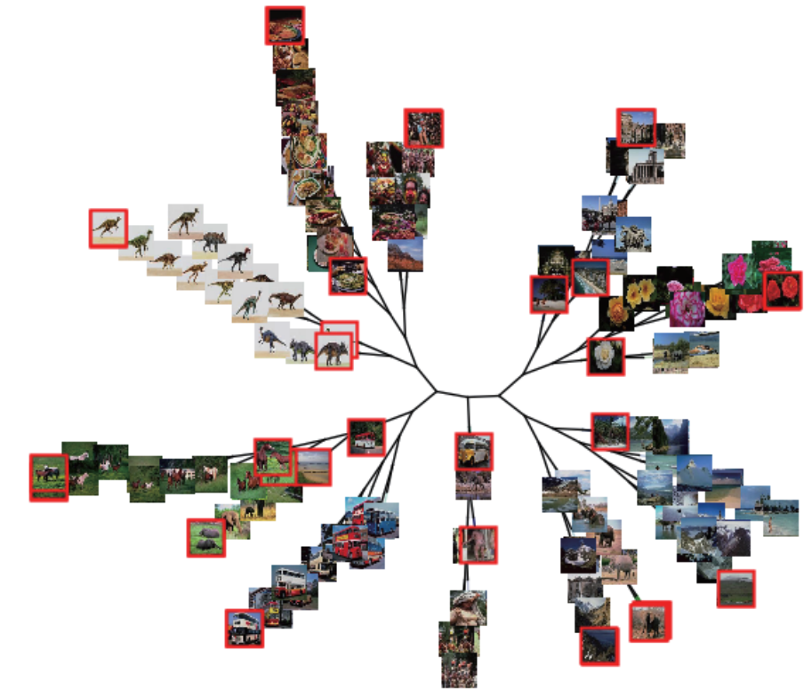| Model Building | (1) [Towards better analysis of machine learning models: A visual analytics perspective](https://arxiv.org/abs/1702.01226) <br/> (2) [Visualization in Bayesian workflow](https://arxiv.org/abs/1709.01449) |
| 13 <br/> 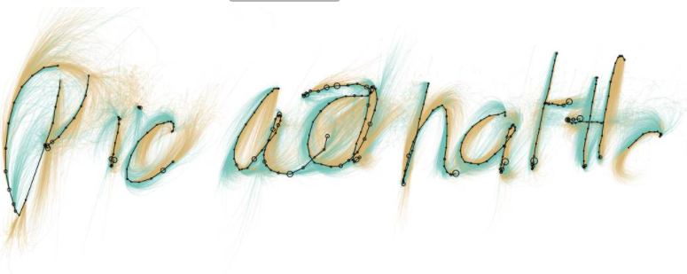| Visualizing Deep Learning Models | (1) [Four Experiments in Handwriting with a Neural Network](https://distill.pub/2016/handwriting/) <br/> (2) [Towards Better Analysis of Deep Convolutional Networks](https://arxiv.org/abs/1604.07043) |
| 13 (optional) | | [Automation Makes Us Dumb](https://www-proquest-com.ezproxy.library.wisc.edu/docview/1626773318/E4C6F4FD50AF4437PQ/1?accountid=465) |
| 14 <br/> 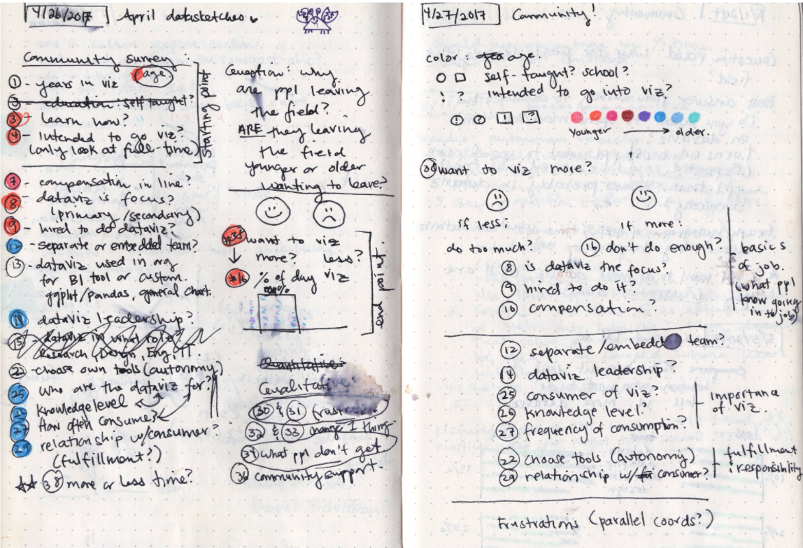| Conclusion | (1) [655 Frustrations of Doing Data Visualization](https://www.datasketch.es/project/655-frustrations-doing-data-visualization) <br/> (2) [Tukey, Design Thinking, and Better Questions](https://simplystatistics.org/2019/04/17/tukey-design-thinking-and-better-questions/) <br/> (3) [As We May Think](https://www.theatlantic.com/magazine/archive/1945/07/as-we-may-think/303881/) |

## Lectures

Notes are listed [here](notes.html). Source code and links to recorded videos
are listed at the top of each set of lecture notes.
