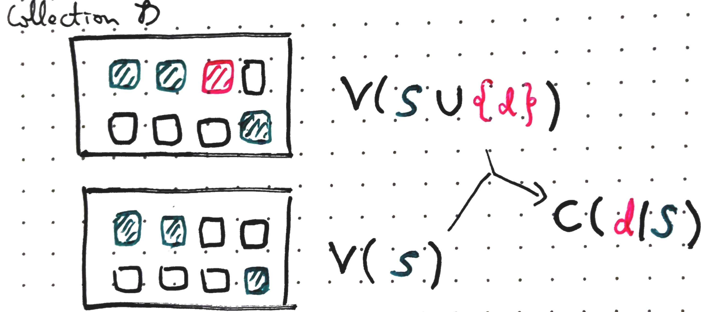
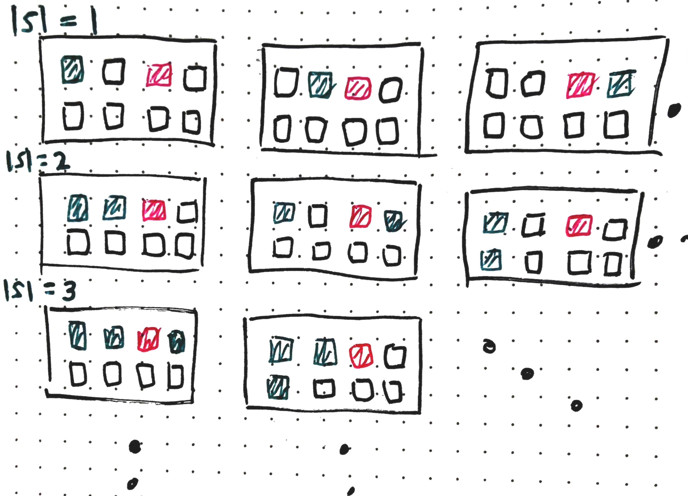
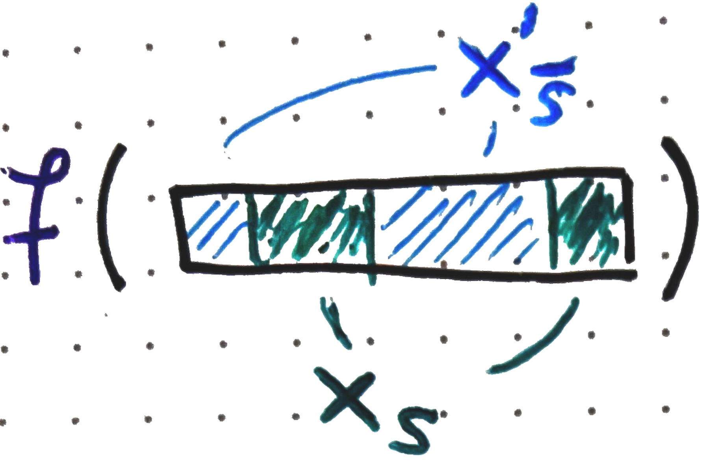
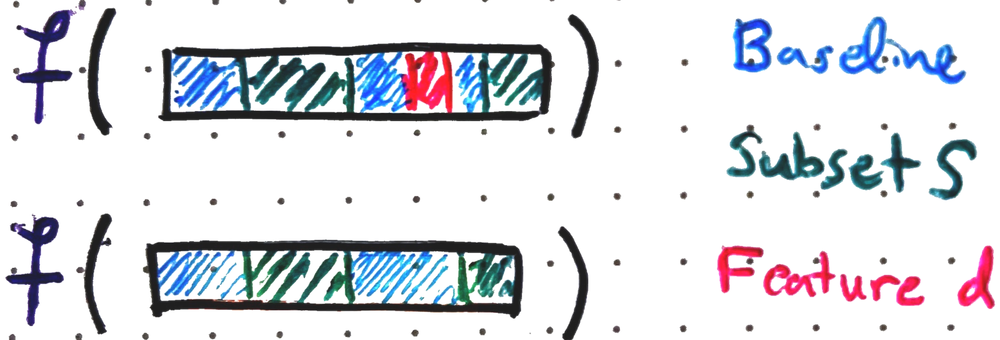
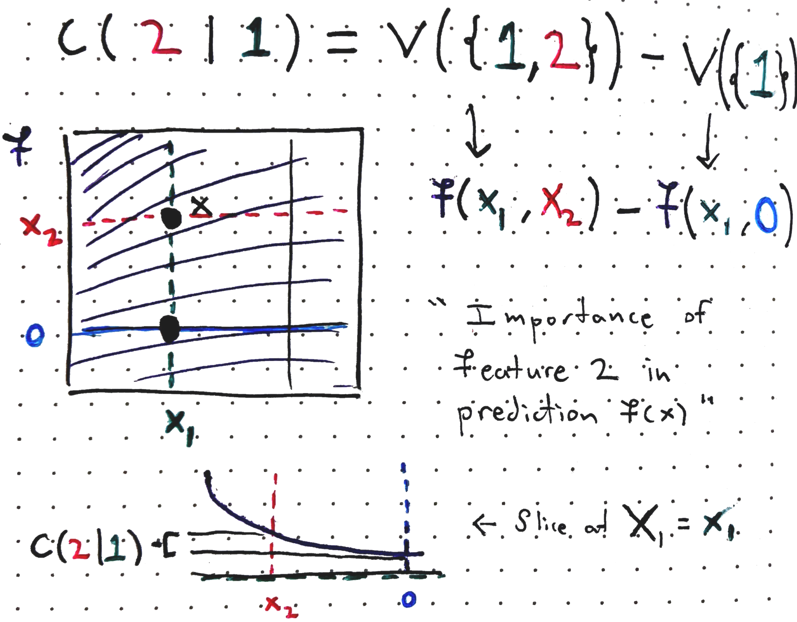
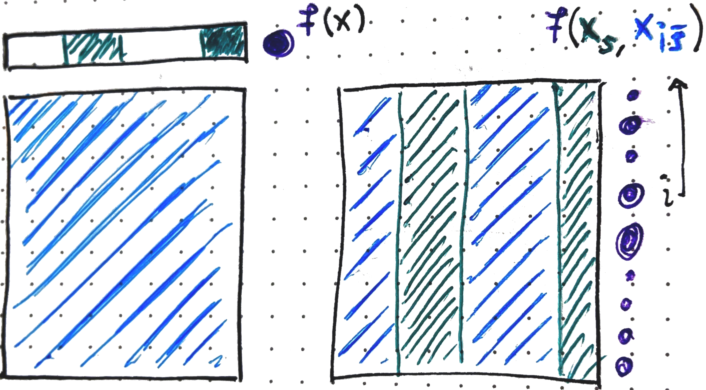

::: {style="display: none;"}
$$
\newcommand{\bs}[1]{\mathbf{#1}}
\newcommand{\reals}{\mathbb{R}}
\newcommand{\widebar}[1]{\overline{#1}}
\newcommand{\E}{\mathbb{E}}
\newcommand{\Earg}[1]{\mathbb{E}\left[{#1}\right]}
\newcommand{\Esubarg}[2]{\mathbb{E}_{#1}\left[{#2}\right]}
$$
:::

<style>
.purple { color: #7458d1ff; } /* pastel purple */
.orange { color: #fca020; } /* pastel orange */
.green { color: #3bbe67ff; } /* pastel green */
.darkblue { color: #4a9ceaff; } /* pastel dark blue */
.pink { color: #ee6ec3ff; } /* pastel pink */
</style>

```{r}
#| label: setup
#| echo: false
library(tidyverse)
library(reticulate)
theme_set(theme_classic() + theme(panel.border= element_rect(fill = NA, linewidth = .5)))
set.seed(2026)
```

```{r}
#| label: python-setup
#| echo: false
# includes the SHAP package. Can install it using,
# > conda env create -f stat479_week6.yml
# where the yaml file is located at:
use_condaenv("stat479_week6")
```

_Readings: [1](https://arxiv.org/abs/2207.07605) (required), [2](https://proceedings.mlr.press/v108/janzing20a.html) (optional)_, _[Code](https://github.com/krisrs1128/stat479_notes/blob/master/notes/09-shap_definitions.qmd)_

Bullet items with $^{\dagger}$ are not in the required reading, so not tested.

## Setup

**Goal.** Given a model <span class="purple">$f$</span> and a sample $x \in \reals^{D}$, return a _local feature attribution_ $\varphi_d\left(x\right)$ that quantifies the contribution of <span class="pink">feature $d$</span> to the prediction <span class="purple">$f\left(x\right)$</span>.

**Requirements.**

   - _Local feature attributions_. Unlike global variable importances,
   $\varphi_d\left(x\right)$ are specific to sample $x$.  This matters a
   stakeholder cares specifically about particular prediction $f(x)$ and wants
   an explanation for it.

   - _Model agnostic_. Attributions should be computable by
   querying $f$ alone, without any assumptions about what kind of model it is --
   it could be a black box.

   - _Principled._ The attribution measure should be derivable from a clear set
   of mathematical axioms.

**Approach.**

SHAP values satisfy all three requirements. This handout focuses on their
theoretical development. Practical computation comes next week.  We proceed in
these steps,

1. _Game theory definitions._ SHAP is inspired by a classic result $n$-player
game theory.  We're not interested in game theory for its own sake, but this
framing will help us see why there are several defensible ways to adapt it to
machine learning.

1. _Machine learning analogy._ We develop an analogy between the game theoretic
definition and quantities of interest in local feature attribution.

1. _Feature removal._ The most ambiguous part of the game theory $\to$ ML
analogy is how implement "feature removal."  Different choices lead to different
SHAP variants

## Local Feature Attributions

1. _High-stakes decisions._ When an individual has a medical diagnosis made or
an insurance claim denied, knowing the globally most important features isn't
enough. They deserve an explanation specific to their case.

   - A related use case is _algorithmic recourse_. What could a stakeholder
   change to reverse a decision? (e.g., which change to their resume would have
   gotten them a job interview?)

1. _Model debugging._ A model might classify $x$ as a husky because it had snow
in the background (large $\varphi_d(x)$ on pixels $d$ in the snow region) rather
than the dog itself. This means the model has learned a "shortcut" and won't
generalize well -- a wolf in the snow might get misclassified as a husky
[@Ribeiro2016].

   {width=60%}

1. _Scientific discovery_. In heterogeneous populations (e.g., different disease
subtypes), a model might rely on different sets of features for each
subpopulation. Local attributions can highlight these differences -- e.g.,
identifying which features drive drug effectiveness in one subgroup vs. another.

   _Exercise: Give one example (hypothetical, or from your own experience) where local feature attribution would be useful. How would it differ from global variable importance?_

## Game Theory Definitions

1. The SHAP algorithm is motivated by the credit assignment problem from game
theory. In this problem, we imagine agents $\mathcal{D} = \{1, \dots, D\}$ and
imagine that if a subset of agents work on a <span class="green">team
$S$</span>, then we observe profit $v(S)$. The question is how much of the
overall company's profit $v(\mathcal{D})$ we should share with agent $d$. Call
this amount the "Shapley value" for <span class="pink">agent $d$</span>, denoted
by $\varphi_{d}(v)$.

1. Intuitively, we can consider how much agent $d$ would add to each team $S$ by
comparing the profits $v(S \cup \{d\})$ and $v(S)$ with and without that agent,
respectively. To this end, define the "contributions" of agent $d$ to team $S$:
$C\left(d \vert S\right) = v(S \cup \{d\}) - v(S)$

   {width=50%}

1. Taking a weighted average of these contributions across subsets $S$, we
arrive at agent $d$'s Shapley value,

   $$
  \varphi_d(v) = \sum_{S \subseteq \mathcal{D} - \{d\}} \frac{1}{D {D - 1 \choose \left|S\right|}} C(d \vert S)
   $$ {#eq-shapley}
   The summation is over all subsets that don't include agent $\{d\}$ (if it had
   included agent $d$, then the definition of the contribution $C(d \vert S)$ of
   $d$ to $S$ wouldn't make sense).

1. Where does the coefficient $1/(D {D - 1 \choose \left|S\right|})$ come
from? The idea is that it makes the SHAP value a weighted average where the
weights sum to 1. To see this, note that for any given size $s$, there are ${D -
1 \choose s}$ coalitions of that size (that exclude agent $d$). The number of
possible coalitions sizes is $s = 0, \dots, D - 1$ (again because we exclude
agent $d$). Therefore, the total weight across all coalitions under
consideration is,

   $$\sum_{s=0}^{D-1} \binom{D-1}{s} \frac{1}{D\binom{D-1}{s}} = \sum_{s=0}^{D-1} \frac{1}{D} = 1.$$

   {width=70%}

1. It turns out that this value is the solution to this problem that satisfies
the following axioms. This fact is often used to justify using this definition
in practice.

   - **Efficiency**. The sum of Shapley values is the profit from the "grand
   coaliation" including all agents minus the profit from the empty coalition,
    $$
    \sum_{d = 1}^{D} \varphi_{d}(v) = v\left(\mathcal{D}\right) - v\left(\emptyset\right)
    $$
    Intuitively, the total company profit is distributed across all employees,
    and nothing is left over.

   - **Monotonicity**. If an agent's marginal contribution is always at least
   as large in one game as in another (intuitively, this could be the profit
   across two separate years), then they should receive at least as much credit
   in the first game. That is, if $v_1\left(S \cup \{d\}\right) - v_1(S) \geq
   v_2\left(S \cup \{d\}\right) - v_2(S)$ for all $S$, then $\varphi_d(v_1) \geq
   \varphi_d(v_2)$.

   - **Symmetry**. If a player always contributes the same amount as another player,
   then the two players should get equal credit. That is, if $v(S \cup \{d\}) =
   v(S \cup \{d'\})$ for every $S$, then $\varphi_d(v) = \varphi_{d'}(v)$.

   - **Missingness**. If agent $d$ never contributes, they should get no credit.
   That is, if $v\left(S \cup \{d\}\right) = v\left(S\right)$ for every team
   $S$, then $\varphi_d(v) = 0$.

## Machine Learning Analogy

1. It's not at all obvious that this has anything to do with machine learning.
But viewed from the right angle, this turns out to give a natural solution to
the local feature attribution problem. Consider,

   - "profit $v(\mathcal{D})$" $\to$ "prediction $f(x)$ on sample $x$."
   - "agent $d$" $\to$ "feature $d$."
   - "team $\mathcal{S} \subset \mathcal{D}$" $\to$ "subset of features $S \subset \mathcal{D}$."

   Instead of distributing profit $v(\mathcal{D})$ across agents, we attribute a
   prediction $f(x)$ across features. We denote the associated attribution
   $\varphi_d(f, x)$

   {width=60%}

1. At a high-level, we want to define $C(d \vert S)$ to represent the change in
our predictions when we are allowed to use feature $d$ vs. when we are forced to
ignore it. Different ways of answering this feature removal question lead to
different definitions of $C$. But once we have this, we can plug it into
Equation @eq-shapley to arrive at a local feature attribution for sample $x$.

   _Exercise: Pick one of the four axioms for game theoretic SHAP. What does it
   imply about $\varphi_d(f, x)$?_

## Deterministic Feature Removal

1. There are three common proposals for feature removal: baseline, marginal, and
conditional. We'll review them one by one.

1. Let <span class="darkblue">$x'$ denote a _baseline_ value</span>. For
example, it could be the vector $\mathbf{0}\in \reals^{D}$, or it could be the
average $\bar{x} \in \reals^{D}$.  Then, we can set,
$$
v(S) = f(x_{S}, x'_{\bar{S}}) \\
$$
where $x_{S}, x_{\bar{S}}$ are used to index the coordinates of $x$ included and
excluded from the <span class="green">set $S$</span>, respectively. This has the
interpretation of being a "simplified" version of <span
class="purple">$f$</span> that uses the real data for coordinates in $S$
and replaces the remaining coordinates with the baseline <span class="darkblue">$x'$</span>.

   {width=35%}

1. The associated contributions have the form:

   $$
   \begin{align*}
   C(d \vert S) &= v\left(S \cup \{d\}\right) - v(S)\\
   &= f\left(x_{S \cup \{d\}}, x'_{\overline{S \cup \{d\}}}\right) - f\left(x_{S}, x'_{\bar{S}}\right)
   \end{align*}
   $$
   which is the change in our prediction when we are allowed to use feature $d$
   (left hand side) vs. when we remove it and replace it with a baseline value
   (right hand side).

   {width=50%}

1. The downside of this approach is that it depends on the choice of baseline
$x'$, and it's not obvious what a good choice of $x'$ should be.

   {width=90%}

## Sampling-based Feature Removal

1. The marginal and conditional approach will replace the deterministic baseline
with expectations over randomly sampled coordinates. Consider $X_{\bar{S}}$ is a
random vector whose coordinates are the features *not* in $S$, drawn from the
same distribution as the training data. The _marginal_ approach defines $v$
using, $$
   v(S) = \Esubarg{p(X_{\bar{S}})}{f(x_{S}, X_{\bar{S}})}
   $$ {#eq-marginal}

   This no longer depends on an arbitrary baseline $x'$, but it still has the
   interpretation of "simplifying" the original function $f$ so that it only
   depends on the coordinates $S$. The simplification occurs by computing the
   average value of $f$ when plugging in random draws of $X_{\bar{S}}$ for the
   coordinates that we want to remove.

1. This is a theoretical expectation, and in practice it's approximated with the
training data, $x_1, \dots, x_{N}$,

   $$
   v(S) = \frac{1}{N} \sum_{i = 1}^{N} f(x_S, x_{i,\bar{S}}).
   $$

   {width=50%}

   Here is a geometric representation for one of the terms in the SHAP
   definition.

   {width=90%}

   _Exercise: What would $C\left(1 \vert 2\right)$ look like in this figure? What about $C\left(2 \vert \emptyset\right)$?_

   _Exercise: Would you expect $\varphi_1(f, x)$ to be larger or smaller than
   $\varphi_2(f, x)$ for the function $f$ and sample $x$ in this visualization?
   Explain your reasoning._

1. A potential downside of this approach is that, if features are correlated,
the marginal approach may evaluate $f$ at unrealistic input combinations. This
is because values $X_{\bar{S}}$ are sampled without reference to the observed
$x_{S}$.

   _Exercise: Can you modify the example in the previous figure to highlight the potential for this extrapolation issue?_

1. The _conditional_ feature removal approach tries to address this problem.
Rather than drawing $X_{\bar{S}}$ from the overall population distribution, we
condition on the coordinates $x_{S}$ of the sample that we're trying to explain,

   $$
   v(S) = \Esubarg{p\left(X_{\bar{S}} \vert X_{S} = x_{S}\right)}{f(x_{S}, X_{\bar{S}})}.
   $$

1. Unfortunately, unlike the marginal approach, there is no obvious estimator to
approximate this theoretical value. Under some assumptions (e.g., multivariate
gaussianity), it might be possible to compute the conditional expectations in
closed form. Alternatively, some researchers advocate learning a new "surrogate"
model that is trained to approximate and support sampling from these conditional
distributions.

## Causal Intervention Perspective

1. $^\dagger$ Some researchers [@janzing20a] have argued that point (3) in the
previous section is not actually a problem, and that, from a causality
perspective, the marginal approach computes the more meaningful expectation.

1. $^\dagger$. To see this, we need to notationally distinguish between observed
data $\tilde{x}$ and prediction algorithm inputs $x$. Denote an intervention
that sets the input coordinates ${S}$ to $x_{S}$ by $\Earg{f(X_{S}, X_{\bar{S}})
\vert \text{do}(X_{S} = x_{S})}$. In the literature on causality, this is called
an _interventional_ conditional distribution.  It is different from ordinary
conditioning on $X_{S} = x_{s}$, because when we intervene on $X_{S}$ we keep
the values of $X_{\bar{S}}$ as they were originally.  Conditioning asks "What do
we expect $X_{\bar{S}}$​ to look like, given $X_S = x_S$ ?" In contrast,
intervening asks "What if we force $X_S = x_S$ and leave everything else
untouched?

1. $^\dagger$ It turns out that
  $$
   \Esubarg{p(X_{\bar{S}})}{f(X_{S}, X_{\bar{S}}) \vert \text{do}(X_{S} = x_{S})} = \Esubarg{p(X_{\bar{S}})}{f(x_{S}, X_{\bar{S}})}
  $$
   The quantity on the right hand side is the marginal expectation we were
   already using in equation @eq-marginal. The quantity on the left hand side is
   the interventional conditional we just introduced. The takeaway is that the
   marginal approach approximates a causally meaningful quantity which better
   matches what we should seek when we try removing the influence of some
   features.

## Code Example

1. Let's apply the `shap` python package to identify important variables in the
`adult` dataset included in the package. Each $x_i$ gives survey responses for
person $i$, and $y_i$ is an indicator of whether they make more than $50K/year.

   ```{python}
#| label: shap-data
import shap

X, y = shap.datasets.adult()
X, y = X.iloc[:2000], y[:2000]   # subsample for speed
X
   ```

1. We train a random forest model to these data using the `sklearn` package.

   ```{python}
#| label: shap-model
from sklearn.ensemble import RandomForestClassifier
model = RandomForestClassifier(n_estimators=100)
model.fit(X, y)
   ```

1. Here, we're explaining the first 50 samples $x_1, \dots, x_{50}$ using the
marginal feature removal approach, as implemented by `KernelExplainer` (we'll go
over the exact computational algorithm next week). The $N = 2000$ rows in `X`
are used in computing the marginal expectation @eq-marginal. Notice that the
explanation function only needs access to the anonymous function `predictor` --
it doesn't require any knowledge of the type of model implemented within it.

   ```{python}
   #| label: shap-values
   X_explain = X.iloc[:50]
   predictor = lambda X: model.predict_proba(X)[:, 1]

   #explainer  = shap.KernelExplainer(predictor, X) # if you want to run accurate version
   explainer  = shap.KernelExplainer(predictor, X.sample(100)) # if you want to run the fast version
   sv = explainer.shap_values(X_explain) # shape: (50 samples, D_features)
   ```

1. A waterfall plot shows $\varphi_d(f, x)$ for all $d$ features. By the
efficiency axiom, the sum of these bars is equal to the predicted response.

   ```{python}
#| label: shap-waterfall
#| fig-width: 8
#| fig-height: 6
exp_single = shap.Explanation(
    values = sv[0],
    base_values = explainer.expected_value,
    data = X_explain.iloc[0].values,
    feature_names = X_explain.columns.tolist(),
)
shap.plots.waterfall(exp_single)
   ```

1. This is the analogous visualization if we stack those bars on top of one
another and then compute the same quantity for many samples. The columns are
sorted so that samples with similar feature attributions go next to one another.
This visualization is helpful for identifying samples that have different
attributions, despite having similar predictions.

   ```{python}
#| label: shap-force
#| fig-width: 12
#| fig-height: 6
shap.plots.initjs()
exp_all = shap.Explanation(
    values = sv,
    base_values = explainer.expected_value,
    data = X_explain.values,
    feature_names = X_explain.columns.tolist(),
)
shap.plots.force(exp_all)
   ```

   _Exercise: Imagine explaining this visualization to a non-data scientist. Describe each component without using technical jargon. Summarize the main takeaways within context of the salary prediction problem._

1. Throughout the note, we've been assuming access to quantities like,
  $$
  \varphi_d(v) = \sum_{S \subseteq \mathcal{D} - \{d\}} \frac{1}{D {D - 1 \choose \left|S\right|}} C(d \vert S)
  $$
  Stepping back, this is actually challenging to compute! It involves a large
  sum, just to explain _a single sample_. In this code example, we've swept this
  computational challenge under the rug. In our next handout, we'll discuss some
  practical strategies to computing SHAP values.
