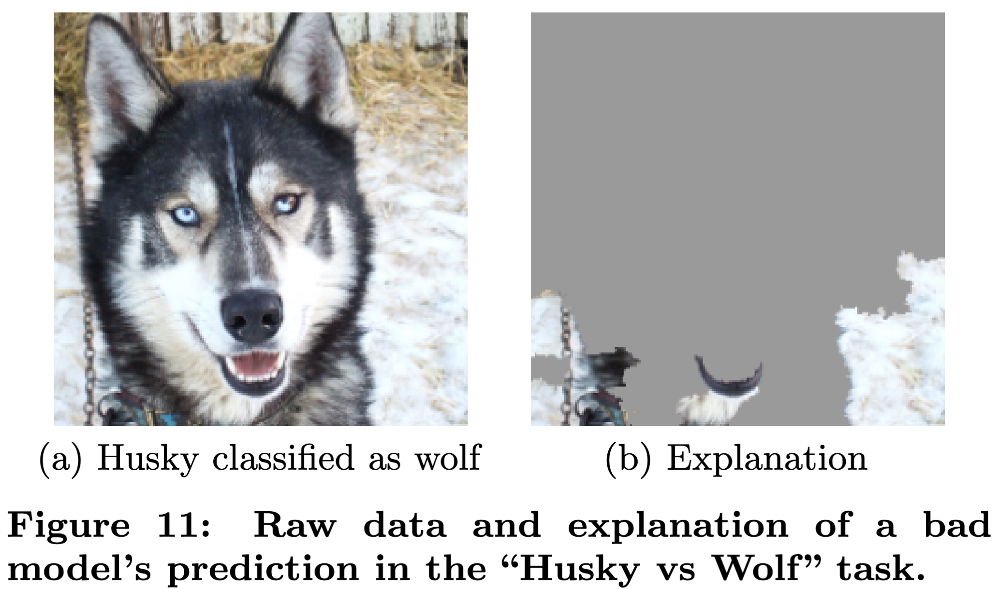

::: {style="display: none;"}
$$
\newcommand{\bs}[1]{\mathbf{#1}}
\newcommand{\reals}{\mathbb{R}}
\newcommand{\widebar}[1]{\overline{#1}}
\newcommand{\E}{\mathbb{E}}
\newcommand{\Earg}[1]{\mathbb{E}\left[{#1}\right]}
\newcommand{\Esubarg}[2]{\mathbb{E}_{#1}\left[{#2}\right]}
$$
:::

<style>
.purple { color: #7458d1ff; } /* pastel purple */
.orange { color: #fca020; } /* pastel orange */
.green { color: #3bbe67ff; } /* pastel green */
.darkblue { color: #4a9ceaff; } /* pastel dark blue */
.pink { color: #ee6ec3ff; } /* pastel pink */
</style>

```{r}
#| label: setup
#| echo: false
library(tidyverse)
theme_set(theme_classic() + theme(panel.border= element_rect(fill = NA, linewidth = .5)))
set.seed(2026)
```

_Readings: [](https://hastie.su.domains/ISLR2/ISLRv2_corrected_June_2023.pdf.download.html)_, _[Code](https://github.com/krisrs1128/stat479_notes/blob/master/notes/09-shap_definitions.qmd)_

Bullet items with $^{\dagger}$ are not in the reading, so not tested.

## Setup

**Goal.** Given a model $f$ and a sample $x \in \reals^{D}$, return a _local feature attribution_ $\varphi_d\left(x_i\right)$ that quantifies the contribution of feature $d$ to the prediction $f\left(x\right)$.

**Requirements.**

   - _Local feature attributions_. In contrast to more generic variable
   importances, attributions $\varphi_d\left(x\right)$ are specific to the sample $x$.
   This can be important when a stakeholder cares specifically about sample
   $x$ and wants an explanation for the associated prediction $f(x)$.

   - _Model agnostic_. It should be possible to compute attributions
   $\varphi_d(x)$ simply by being able to query $f$. We should make no
   assumptions about what type of model $f$ is -- it could be a black box. This
   is a continuation of the trend we started last week, where we sacrified the
   intrinsic interpretability of CART for the predictive accuracy of tree
   ensembles, but still sought ought variable importance measures to interpret
   the result.

   - _Mathematically principled._ The attribution measure should be derivable
   from first principles using a clear set of mathematical axioms.

**Approach.**

SHAP values satisfy all three requirements above. This handout will focus on the
theoretical development of SHAP values -- we will consider their practical
computation later. We will develop the method in these steps,

1. _Game theory definitions._ The main inspiration for SHAP algorithms in
machine learning comes from a classic result in the theory of $n$-player games.
Even though we're not interested in game theory per se, understanding the
original framing will help us see why there are several defensible ways to apply
it to machine learning.

1. _Machine learning analogy._ We will develop an analogy between the original
game theoretic definition and the quantities of interest in local feature
attribution for machine learning models.

1. _Feature removal._ The most ambiguous part of the game theory $\to$ ML
analogy is how exactly to implement the "feature removal" step. We will review
several approaches and the arguments for an dagainst them.

## Local Feature Attributions

1. Local feature attributions are potentially useful in high-stakes decision
making. When individual $i$'s medical diagnosis is made or their insurance claim
is denied, it's not enough to know the generally most important features. They
deserve to know the most important features in their particular case.

   - A related use case is algorithmic recourse, which refers to when a
   stakeholder wants to know what they can change in order to change a decision
   made by an algorithm (e.g., could they have changed anything in their
   application that would have gotten them a job interview?).

1. Another use of local feature attributions is for model debugging. For
example, we might discover that a particular sample $x$ was classified as a
husky $f(x)$ because it had snow in the background (large $\varphi_d(x)$ on
pixels $d$ in the snow region of the image). This is important to know, because
it means the model has learned a "shortcut" and wouldn't generalize well -- e.g,
a wolf appearing in the snow might get classified as husky [@Ribeiro2016].

   {width=60%}

1. For scientific discovery, we also often want sample-specific attributions.
This is because we often work in heterogeneous populations (e.g., different
disease subtypes), and the model might have learned different "reasons" for
making a prediction (e.g,. probability of a candidate drug's success) in one
subpopulation compared to another.

## Game Theory Definitions

1. The SHAP algorithm is motivated by the credit assignment problem from game
theory. In this problem, we imagine agents $\mathcal{D} = \{1, \dots, D\}$ and
imagine that if a subset of agents work on a team $S$, then we observe profit
$v(S)$. The question is how much of the overall company's profit
$v(\mathcal{D})$ we should share with agent $d$. Call this amount the "Shapley
value" for agent $d$, denoted by $\varphi_{d}(v)$.

1. Intuitively, we can consider how much agent $d$ would add to each team $S$ by
comparing the profits $v(S \cup \{d\})$ and $v(S)$ with and without that agent,
respectively. To this end, define the "contributions" of agent $d$ to team $S$:
$C\left(d \vert S\right) = v(S \cup \{d\}) - v(S)$

1. Taking a weighted average of these contributions across subsets $S$, we
arrive at agent $d$'s Shapley value,

   $$
  \varphi_d(v) = \sum_{S \subseteq \mathcal{D} - \{d\}} \frac{1}{D {D - 1 \choose \left|S\right|}} C(d \vert S)
   $$ {#eq-shapley}
   The summation is over all subsets that don't include agent $\{d\}$ (if it had
   included agent $d$, then the definition of the contribution $C(d \vert S)$ of
   $d$ to $S$ wouldn't make sense).

1. Where does the coefficient $1/(D {D - 1 \choose \left|S\right|})$ come
from? The idea is that it makes the SHAP value a weighted average where the
weights sum to 1. To see this, note that for any given size $s$, there are ${D -
1 \choose s}$ coalitions of that size (that exclude agent $d$). The number of
possible coalitions sizes is $s = 0, \dots, D - 1$ (again because we exclude
agent $d$). Therefore, the total weight across all coalitions under
consideration is,

   $$\sum_{s=0}^{D-1} \binom{D-1}{s} \frac{1}{D\binom{D-1}{s}} = \sum_{s=0}^{D-1} \frac{1}{D} = 1.$$

1. It turns out that this value is the solution to this problem that satisfies
the following axioms. This fact is often used to justify using this definition
in practice.

   - **Efficiency**. The sum of Shapley values is the profit from the "grand
   coaliation" including all agents minus the profit from the empty coalition,
    $$
    \sum_{d = 1}^{D} \varphi_{d}(v) = v\left(\mathcal{D}\right) - v\left(\emptyset\right)
    $$
    Intuitively, the total company profit is distributed across all employees,
    and nothing is left over.

   - **Monotonicity**. If an agent always always contributes more in one game
   than another (intuitively, this could be the profit across two separate
   years), then they should have higher credit in that game. That is, if
   $v_1\left(S \cup \{d\}\right) > v_2\left(S \cup \{d\}\right)$ then
   $\varphi_d(v_1) > \varphi_d(v_2)$.

   - **Symmetry**. If a player always contributes the same amount as another player,
   then the two players should get equal credit. That is, if $v(S \cup \{d\}) =
   v(S \cup \{d'\})$ for every $S$, then $\varphi_d(v) = \varphi_{d'}(v)$.

   - **Missingness**. If agent $d$ never contributes, they should get no credit.
   That is, if $v\left(S \cup \{d\}\right) = v\left(S\right)$ for every team
   $S$, then $\varphi_d(v) = 0$.

## Machine Learning Analogy

1. It's not at all obvious that this has anything to do with machine learning.
But viewed from the right angle, this turns out to give a natural solution to
the local feature attribution problem. Consider,

   - "profit $v(\mathcal{D})$" $\to$ "prediction $f(x)$ on sample $x$."
   - "agent $d$" $\to$ "feature $d$."
   - "team $\mathcal{S} \subset \mathcal{D}$" $\to$ "subset of features $S \subset \mathcal{D}$."

   Instead of distributing profit $v(\mathcal{D})$ across agents, we attribute a
   prediction $f(x)$ across features. We denote the associated attribution
   $\varphi_d(f, x)$

1. At a high-level, we want to define $C(d \vert S)$ to represent the change in
our predictions when we are allowed to use feature $d$ vs. when we are forced to
ignore it. Different ways of answering this feature removal question lead to
different definitions of $C$. But once we have this, we can plug it into
Equation @eq-shapley to arrive at a local feature attribution for sample $x$.

## Deterministic Feature Removal

1. There are three common proposals for feature removal: baseline, marginal, and
conditional. We'll review them one by one.

1. Let $x'$ denote a _baseline_ value. For example, it could be the vector
$\mathbf{0}\in \reals^{D}$, or it could be the average $\bar{x} \in \reals^{D}$.
Then, we can set,
$$
v(S) = f(x_{S}, x'_{\bar{S}}) \\
$$
where $x_{S}, x_{\bar{S}}$ are used to index the coordinates of $x$ included and
excluded from the set $S$, respectively. This has the interpretation of being a
"simplified" version of $f$ that ignores any of the real data coordinates in $S$
and replaces them by a baseline value $x'$.

1. The associated contributions have the form:

   $$
   \begin{align*}
   C(d \vert S) &= v\left(S \cup \{d\}\right) - v(S)\\
   &= f\left(x_{S \cup \{d\}}, x'_{\overline{S \cup \{d\}}}\right) - f\left(x_{S}, x'_{\bar{S}}\right)
   \end{align*}
   $$
   which is the change in our prediction when we are allowed to use feature $d$
   (left hand side) vs. when we remove it and replace it with a baseline value
   (right hand side).

1. The downside of this approach is that it depends on the choice of baseline
$x'$, and it's not obvious what a good choice of $D$ should be.

## Sampling-based Feature Removal

1. The marginal and conditional approach will replace the deterministic baseline
with expectations over randomly sampled coordinates. Let $X_{S}$ denote a random
variable defined over the coordinates $S$ (define $X_{\bar{S}}$ similarly).  The
_marginal_ approach defines $v$ using,
   $$
   v(S) = \Esubarg{p(X_{\bar{S}})}{f(x_{S}, X_{\bar{S}})}
   $$ {#eq-marginal}

   This no longer depends on an arbitrary baseline $x'$, but it still has the
   interpretation of "simplifying" the original function $f$ so that it only
   depends on the coordinates $S$. The simplification occurs by computing the
   average value of $f$ when plugging in random draws of $X_{\bar{S}}$ for the
   coordinates that we want to remove.

1. This is a theoretical expectation, and in practice it's approximated with the
training data, $x_1, \dots, x_{N}$,

   $$
   v(S) = \frac{1}{N} \sum_{i = 1}^{N} f(x_S, x_{i,\bar{S}}).
   $$

1. A potential downside of this approach is that, if the coordinates $S$ and
$\bar{S}$ are correlated, then some of the sampled values $f(x_{S},
X_{\bar{S}})$ might never appear in any real data (since we sample the
coordinates $\bar{S}$ without referring to the current observation). That is, we
might accidentally evaluate $f$ in a region of the data space far from any
actual observations, and the function $f$ might behave unpredictably when we
extrapolate in this way.

1. The _conditional_ feature removal approach tries to address this problem.
Rather than drawing $X_{\bar{S}}$ from the overall population distribution, we
condition on the coordinates $x_{S}$ of the sample that we're trying to explain,

   $$
   v(S) = \Esubarg{p\left(X_{\bar{S}} \vert X_{S} = x_{S}\right)}{f(x_{S}, X_{\bar{S}}) \vert X_{S} = x_{S}}.
   $$

1. Unfortunately, unlike the marginal approach, there is no obvious estimator to
approximate this theoretical value. Under some assumptions (e.g., multivariate
gaussianity), it might be possible to compute the conditional expectations in
closed form. Alternatively, some researchers advocate learning a new "surrogate"
model that is trained to approximate and support sampling from these conditional
distributions.

## Causal Intervention Perspective

1. $^\dagger$ Some researchers [@janzing20a] have argued that point (3) in the
previous section is not actually a problem, and that, from a causality
perspective, the marginal approach computes the more meaningful expectation.

1. $^\dagger$. To see this, we need to notationally distinguish between observed
data $\tilde{x}$ and prediction algorithm inputs $x$. Denote an intervention
that sets the input coordinates ${S}$ to $x_{S}$ by $\Earg{f(X_{S}, X_{\bar{S}})
\vert \text{do}(X_{S} = x_{S})}$. In the literature on causality, this is called
an _interventional_ conditional distribution. It is different from ordinary
conditioning on $X_{S} = x_{s}$, because when we intervene on $X_{S}$ we keep
the values of $X_{\bar{S}}$ as they were originally (we don't adjust our
prediction for plausible values over $\bar{S}$ conditional on the newly
intervened coordinates $S$).

1. $^\dagger$ It turns out that
  $$
   \Esubarg{p(X_{\bar{S}})}{f(X_{S}, X_{\bar{S}}) \vert \text{do}(X_{S} = x_{S})} = \Esubarg{p(X_{\bar{S}})}{f(x_{S}, X_{\bar{S}})}
  $$
   The quantity on the right hand side is the marginal expectation we were
   already using in equation @eq-marginal. The quantify on the left hand side is
   the interventional conditional we just introduced. The takeaway is that the
   marginal approach approximates a causally meaningful quantity which better
   matches what we should seek when we try removing the influence of some
   features.

## Code Example

1. Throughout the note, we've been assuming access to quantities like,
  $$
  \varphi_d(v) = \sum_{S \subseteq \mathcal{D} - \{d\}} \frac{1}{D {D - 1 \choose \left|S\right|}} C(d \vert S)
  $$
  Stepping back, this is actually quite challenging to compute! It involves a
  large sum, just to explain _a single sample_. In this code example, we've
  swept this computational challenge under the rug. In our next handout, we'll
  discuss some practical strategies to computing SHAP values.